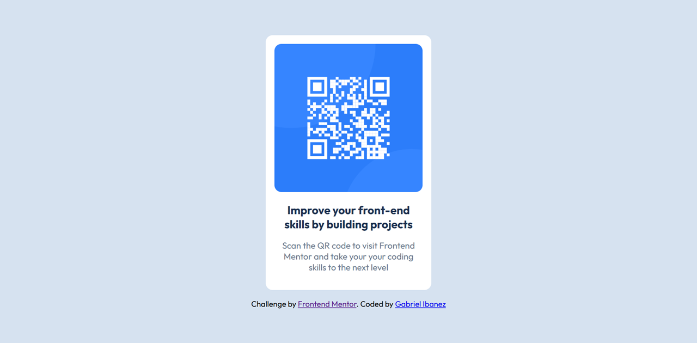

# Frontend Mentor - QR code component solution

This is a solution to the [QR code component challenge on Frontend Mentor](https://www.frontendmentor.io/challenges/qr-code-component-iux_sIO_H). Frontend Mentor challenges help you improve your coding skills by building realistic projects. 

# Screenshot

# Links

- Solution URL: [Add solution URL here](https://your-solution-url.com)
- Live Site URL: [Add live site URL here](https://your-live-site-url.com)

# Built with

- HTML
- CSS

# Author

- Frontend Mentor - [@code-with-aeon](https://www.frontendmentor.io/profile/code-with-aeon)
- Github - [@ibanezgabriel](https://github.com/ibanezgabriel)
